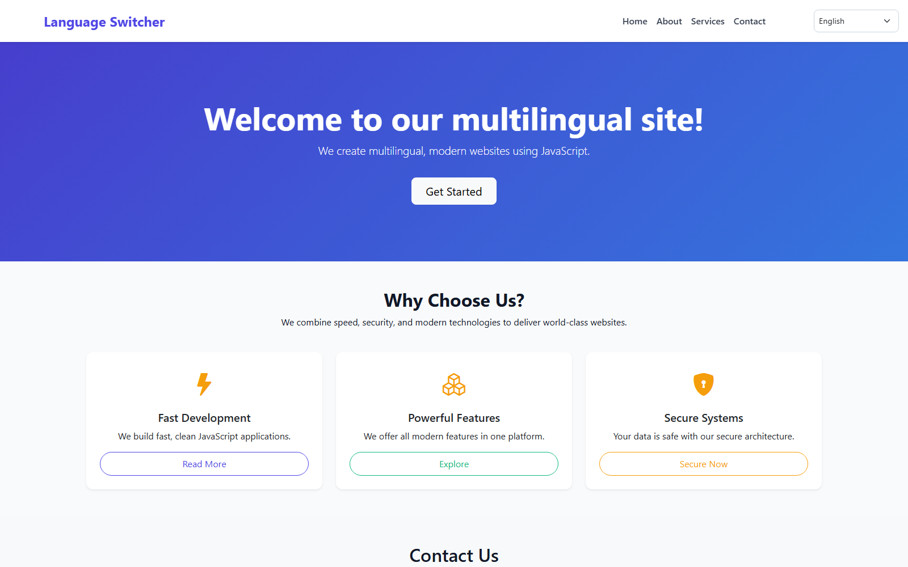
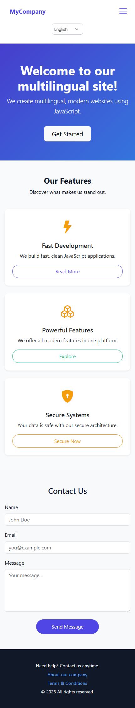

# 🌐 JavaScript Language Switcher

**JavaScript Language Switcher** is a **lightweight, dependency-free multilingual website template** that swaps every piece of on-page text on the fly — no page reload, no framework. Text elements are marked with a simple `data-t="key"` attribute, translations live in small JSON files, and the last-used language is remembered in `localStorage`, making it a solid reference project for learning i18n patterns in plain JavaScript.

<p align="left">
  
  
  
  
  
</p>

## 📚 Table of Contents

- [Features](#-features)
- [Preview](#-preview)
- [Project Structure](#-project-structure)
- [How It Works](#-how-it-works)
- [Installation Guide](#️-installation-guide)
- [Adding a New Language](#-adding-a-new-language)
- [Technologies Used](#-technologies-used)
- [License](#-license)
- [Contributing](#-contributing)
- [Connect with Me](#-connect-with-me)

## ✨ Features

✅ **4 languages out of the box:** English, O'zbekcha, Русский, and Тоҷикӣ.
✅ **Pure vanilla JavaScript:** No frameworks or build tools required.
✅ **Attribute-driven translations:** Just add `data-t="key"` to any HTML element.
✅ **Instant switching:** Text updates immediately on selection, no page reload.
✅ **Persistent preference:** The chosen language is saved in `localStorage` and restored on return visits.
✅ **Responsive UI:** Built on **Bootstrap 5** for a clean layout on every screen size.
✅ **Easy to extend:** Add a new language by dropping in one JSON file.

## 👀 Preview

### 💻 Desktop


### 📱 Mobile


## 📂 Project Structure

```
javascript-language-switcher/
├── src/
│   ├── css/
│   │   └── styles.css       # Layout, navbar, hero, and card styles
│   ├── js/
│   │   └── lang.js          # Language detection, loading, and DOM translation logic
│   ├── lang/
│   │   ├── en.json           # English translations
│   │   ├── ru.json           # Russian translations
│   │   ├── uz.json           # Uzbek translations
│   │   └── tj.json           # Tajik translations
│   └── images/                # Screenshots used in this README
├── favicon.ico
├── index.html                  # Page markup with data-t="key" placeholders
└── README.md
```

## 📌 How It Works

1. Every translatable element in `index.html` carries a `data-t="key"` attribute, e.g. `<h1 data-t="hero.title"></h1>`.
2. On load, `src/js/lang.js` picks the active language (saved preference, or `en` by default) and fetches the matching file from `src/lang/`.
3. Each `[data-t]` element's text is replaced with the value at that key path in the JSON file (e.g. `hero.title`).
4. Selecting a different language in the dropdown re-runs the same process and saves the new choice to `localStorage`.

## ⚙️ Installation Guide 🛠️

### 1️⃣ Clone the Repository 📥
```bash
git clone https://github.com/Iqbolshoh/javascript-language-switcher.git
```

### 2️⃣ Navigate to the Project Directory 📂
```bash
cd javascript-language-switcher
```

### 3️⃣ Run the App 🌐
Open `index.html` directly in your browser, or serve it with any local dev server (recommended, since some browsers restrict `fetch()` on the `file://` protocol):
```bash
php -S localhost:8000
```
Then visit **`http://localhost:8000`** and use the language dropdown in the top-right corner of the navbar.

## 🧩 Adding a New Language

1. Create a new file in `src/lang/`, e.g. `src/lang/fr.json`, using `src/lang/en.json` as a template.
2. Add a matching `<option value="fr">Français</option>` to the `#langSwitcher` dropdown in `index.html`.
3. Done — the new language is now selectable and persisted like the others.

## 🖥 Technologies Used


## 📜 License
This project is open-source and available under the [MIT License](./LICENSE).

## 🤝 Contributing
🎯 Contributions are welcome! If you have suggestions or want to enhance the project, feel free to fork the repository and submit a pull request.

## 📬 Connect with Me
💬 I love meeting new people and discussing tech, business, and creative ideas. Let's connect! You can reach me on these platforms:

<div align="center">

[](https://iqbolshoh.uz)
[](mailto:iilhomjonov777@gmail.com)
[](https://github.com/iqbolshoh)
[](https://t.me/+998776030033)
[](https://wa.me/998776030033)
[](https://instagram.com/iqbolshoh.dev)
[](https://www.youtube.com/@Iqbolshoh_dev)

</div>
